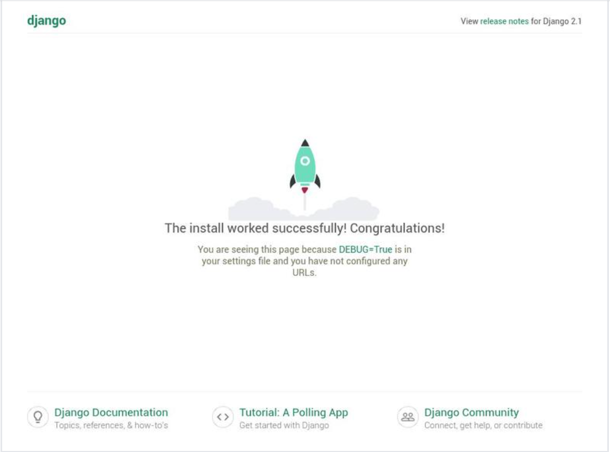

# Steps to create Django development server
## Install Django on Ubuntu
1. Installing Python 3 and venv

 
       $python3 --version

    The output should look like this:

        Python 3.6.6

    Starting from Python 3.6, the recommended way to create a virtual environment is to use the venv module. To install the python3-venv package that provides the venv module run the following command:
           
        $ sudo apt install python3-venv

    Once the module is installed we are ready to create a virtual environment for our Django application.

    Creating a Virtual Environment
    Start by navigating to the directory where you would like to store your Python 3 virtual environments. It can be your home directory or any other directory where your user has read and write permissions.

    Create a new directory for your Django application and navigate into it:

        $mkdir my_django_app
        $cd my_django_app

    Once inside the directory, run the following command to create your new virtual environment:

       $python3 -m venv venv

    The command above creates a directory called venv, which contains a copy of the Python binary, the Pip package manager , the standard Python library and other supporting files. You can use any name you want for the virtual environment.

    To start using this virtual environment, you need to activate it by running the activate script:
     
       $source venv/bin/activate
    
    Once activated, the virtual environment’s bin directory will be added at the beginning of the $PATH variable. Also your shell’s prompt will change and it will show the name of the virtual environment you’re currently using. In our case that is venv.

2. Installing Django
     
    Now that the virtual environment is activated, you can use the Python package manager pip to install Django:
     
    (venv)$ pip install django 

    <mark>Note: Within the virtual environment, you can use the command pip instead of pip3 and python instead of python3.</mark>

    To verify the installation use the following command which will print the Django version:
   
       (venv)$ python -m django --version 

    At the time of writing this article, the latest official Django version is 1.1.6

    output :

        1.1.6
 
    
3. Creating a Django Project
    
    To create a new Django project named mydjangoapp use the django-admin command-line utility:

       (venv)$ django-admin startproject myapp

    The command above will create a mydjangoapp directory in your current directory.

       (venv)$ tree myapp
    
    above command output like below:

    output :

        mydjangoapp/
        |-- manage.py
        |-- mydjangoapp
        |-- __init__.py
        |-- settings.py
        |-- urls.py
        | -- wsgi.py

    Inside that directory, you will find the main script for managing projects named manage.py and another directory including database configuration, and Django and application-specific settings.

    Let’s migrate the database and create an administrative user.

    Start by navigating to the myapp directory:

       (venv)$ cd myapp

    By default, Django uses a SQLite database. For production applications, you can use PostgreSQL , MariaDB , Oracle or MySQL Database.

    Run the following command to migrate the database:

       (venv)$ python manage.py migrate

    The output will look something like the following:

     output :

        Operations to perform:
        Apply all migrations: admin, auth, contenttypes, sessions
        Running migrations:
        Applying contenttypes.0001_initial... OK
        Applying auth.0001_initial... OK
        Applying admin.0001_initial... OK
        Applying admin.0002_logentry_remove_auto_add... OK
        Applying admin.0003_logentry_add_action_flag_choices... OK
        Applying contenttypes.0002_remove_content_type_name... OK
        Applying auth.0002_alter_permission_name_max_length... OK
        Applying auth.0003_alter_user_email_max_length... OK
        Applying auth.0004_alter_user_username_opts... OK
        Applying auth.0005_alter_user_last_login_null... OK
        Applying auth.0006_require_contenttypes_0002... OK
        Applying auth.0007_alter_validators_add_error_messages... OK
        Applying auth.0008_alter_user_username_max_length... OK
        Applying auth.0009_alter_user_last_name_max_length... OK
        Applying sessions.0001_initial... OK

    Once the database is migrated, create an administrative user so that you can use the Django admin interface:

       (venv)$ python manage.py createsuperuser

    The command will prompt you for a username, an email address, and a password for your administrative user.

    output:

        Username (leave blank to use 'xyz'): admin
        Email address: admin@gmail.com
        Password:
        Password (again):
        Superuser created successfully.

4. Testing the Development Server

    Start the development web server using the manage.py script followed by the runserver option:

       (venv)$ python manage.py runserver

    You’ll see the following output:

    output: 
        
        Performing system checks...
        
        System check identified no issues (0 silenced).
        December 23, 2022 - 11:16:28
        Django version 2.1.2, using settings 'myapp.settings'
        Starting development server at http://127.0.0.1:8000/
        Quit the server with CONTROL-C.

    <mark>If you installed Django on a virtual machine and you want to access Django development server then you’ll need to edit the settings.py file and add the server IP address inside the ALLOWED_HOSTS list.</mark>

    Open http://127.0.0.1:8000 in your web browser and you will be presented with the default Django landing page:
   
   

   
   

    
    

    

